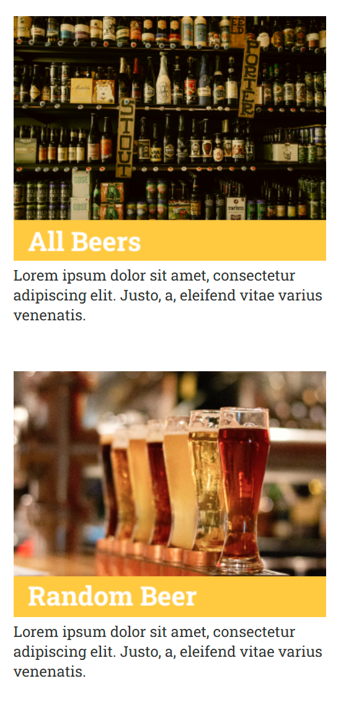
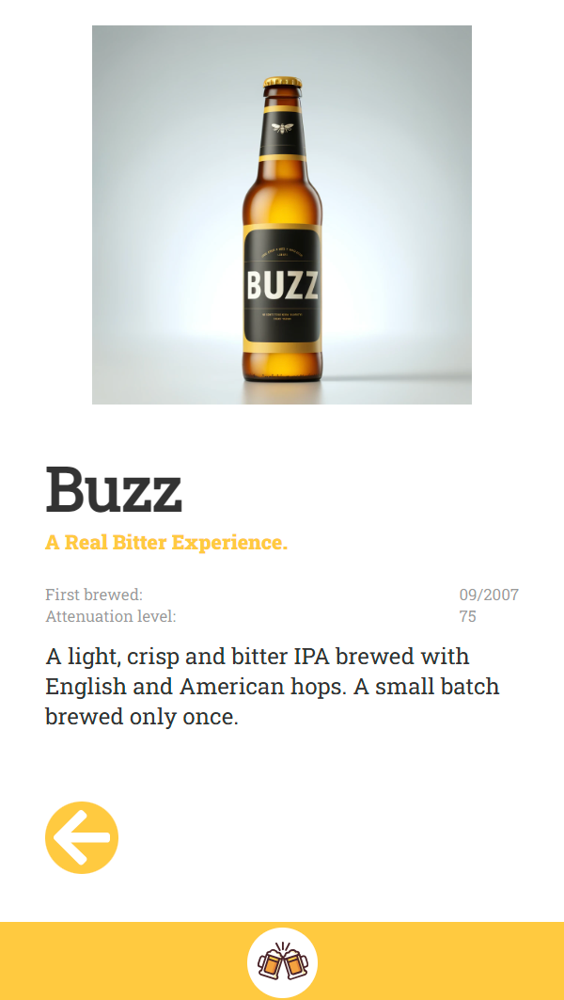

# 🍺 Abschlussprojekt: React Beer API

Diese Webanwendung zeigt verschiedene Biersorten aus einer externen API, stellt detaillierte Informationen zu jedem Bier bereit und erlaubt dem Benutzer, sich ein zufälliges Bier anzeigen zu lassen. Das Projekt wurde im Rahmen einer Frontend-Ausbildung mit **React**, **TypeScript** und **Vite** umgesetzt.

🔗 **Live-Demo**: [tinabk-react-beer-api.netlify.app](https://tinabk-react-beer-api.netlify.app/)

## 🧰 Verwendete Technologien & Tools

- ⚛️ **React** – komponentenbasiertes JavaScript-Framework für die Benutzeroberfläche.
- 🟦 **TypeScript** – typisierte Superset von JavaScript für bessere Codequalität.
- ⚡ **Vite** – moderner und schneller Build- und Entwicklungsserver.
- 🎨 **CSS3** – für das Layout, Animationen und allgemeines Styling.
- 🗃️ **Modulare Komponentenstruktur** – für Wiederverwendbarkeit und Klarheit.
- 🧠 **REST API ([Ironhack Beers API](https://ih-beers-api2.herokuapp.com/beers/))** – zur dynamischen Datenabfrage von Biersorten.
- 🔠 **Google Fonts: Roboto & Roboto Slab** – für eine moderne Typografie.
- 🧩 **Eigenes Interface (`IBeers.ts`)** – zur Definition der Bier-Datenstruktur.
- 🛠️ **VS Code**, **Git** & **GitHub** – als Entwicklungsumgebung und zur Versionskontrolle.

## 🔧 Funktionen

### 📋 Bierliste anzeigen
- Auf der Seite **„All Beers“** werden alle Biere mit Bild, Name und Slogan angezeigt.
- Beim Klick auf ein Bier öffnet sich die Detailansicht.

### 🔍 Bierdetails
- Zeigt genauere Informationen über ein gewähltes Bier:
  - Name, Beschreibung, Alkoholgehalt, Gebräut seit, Tipps vom Braumeister u. v. m.

### 🎲 Zufälliges Bier
- Ein Button zeigt ein zufällig ausgewähltes Bier aus der API.

### 🌀 Ladeanimation
- Beim Datenladen wird ein animierter Ladeindikator angezeigt.

### 🔙 Navigation
- Zurück-Buttons, Home-Buttons mit Logosymbolen, sowie Link zum Zufallsbier.

## Kontaktinformationen

Falls Sie Fragen oder Vorschläge haben, können Sie mich kontaktieren:
- **E-Mail**: barshchevskak@gmail.com
- **GitHub**: [TinaBK24](https://github.com/TinaBK24)

## Screenshots

### 🔻 Home

### 🔻 Zufälliges Bier

